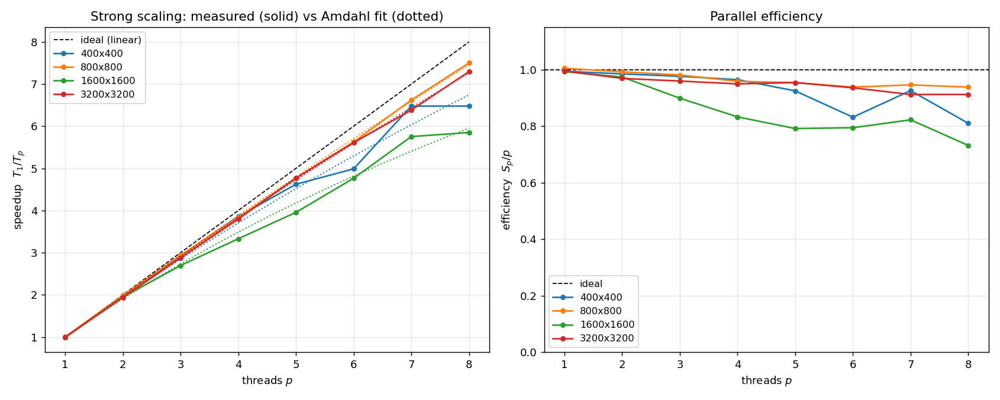
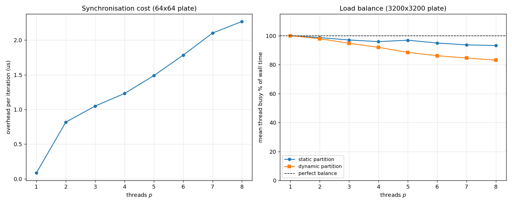
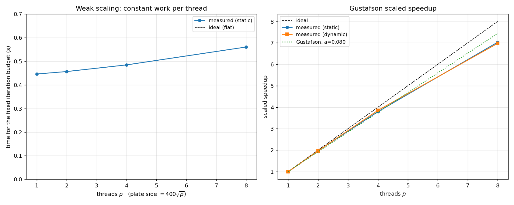

# 159.735 Assignment 3
## Parallel Solution of the Heat Distribution Problem
### Measured on the 159.735 HPC node

---

## 1. Platform

| | |
|---|---|
| Machine | `hpc-parallelgpu01`, Intel **Xeon Gold 6242R** @ 3.10 GHz |
| Cores | **8 logical CPUs = 8 physical cores**, homogeneous, no SMT presented |
| Memory | 31 GB |
| OS | Ubuntu 24.04.4 LTS, kernel 6.8.0-139-generic, x86-64 |
| Compiler | g++ 13.3.0 (Ubuntu 13.3.0-6ubuntu2~24.04.1), `-O3` |
| OpenMP | GCC `libgomp`, `-fopenmp`, `OMP_PROC_BIND=close`, `OMP_PLACES=cores` |
| FITS | cfitsio (distro package, located by `pkg-config`) |
| Load at start | 0.04 / 0.24 / 0.14 — an effectively idle machine |

Two things about this platform shape everything below.

**The cores are all the same.** Eight logical CPUs map to eight physical
cores with no hyperthreading presented, so a thread pinned to a core gets a
whole core, and every core is as fast as every other one. That is the machine
the textbook analysis assumes, and the results in section 7 are correspondingly
textbook. The companion study in `REPORT.md`, run on a 10-core
heterogeneous laptop, is the same source code on a machine that violates that
assumption; section 9 compares the two, and the comparison is the most
interesting result in either report.

**Eight cores is a slice of a larger part.** The 6242R model number denotes a
20-core socket, so the eight CPUs visible here are a partition of one. This is
an inference from the model number rather than something the node reports, but
it is worth stating because it means the last-level cache and the memory
controllers are shared with whatever else occupies the socket. It is the most
likely explanation for the one anomaly in the results (section 7.1), and it is
a reason to prefer the *fastest* of several repeats, which is what the analysis
does.

The node was idle and the runs were pinned, so the measurements here are much
cleaner than laptop measurements can be.

---

## 2. The problem and the numerical method

Laplace's equation is solved on a square plate by explicit finite
differences. The updated temperature of a pixel is the average of its four
neighbours,

```
g(y,x) = ( h(y,x-1) + h(y,x+1) + h(y-1,x) + h(y+1,x) ) / 4
```

which is Jacobi iteration: the whole new image `g` is computed from the old
image `h`, and only then does `g` become the current image.

The plate edge, the cold finger heat sink and the printed circuit components
are Dirichlet boundary conditions — they hold a fixed temperature for the
whole run. They are drawn by `fix_boundaries2()` from the supplied
`draw.hxx`, unmodified.

**Convergence.** A pixel has settled when it moved by less than
`tol = 1e-5 K` in a sweep. The plate has converged when *every* interior
pixel has settled. Pixels on the outer edge are fixed, so they are converged
by definition and are left out of the count; requiring all
`(npix-2) x (npix-2)` interior pixels to settle is exactly equivalent to
requiring all `npix x npix` of them.

The number of iterations this takes is not known in advance. Jacobi's
convergence rate is set by the spectral radius of its iteration matrix,
`cos(pi/(n+1)) ~ 1 - pi^2/2n^2`, which predicts an iteration count growing as
`n^2`. The measured counts fit `n^1.83` — slightly below `n^2` because the
stopping test is an absolute threshold on the per-iteration *change*, and the
change at a given error level is itself proportional to `1/n^2`, so the test
is relatively easier to satisfy on a larger plate. Folding that in, the model
`k = A n^2 (B - 2 ln n)` reproduces all four measured counts to within 2.5%:

| plate | 100x100 | 200x200 | 400x400 | 800x800 |
|---|---:|---:|---:|---:|
| iterations to converge | 3,711 | 13,543 | 47,875 | 165,265 |

These counts are a property of the mathematics, not of the machine: the node
and the laptop produced the same four numbers.

---

## 3. The programs

| File | What it is |
|---|---|
| `heat.cpp` | sequential solution |
| `heat_omp.cpp` | OpenMP parallel solution |
| `heatutil.hxx` | **everything the two have in common** — the Jacobi sweep itself, the fixed-pixel mask, the row partitioning, the timer, the image hash |
| `makefile` | `make heat`, `make heat_omp`, or just `make` |
| `run_scaling.sh`, `analyse.py` | the measurements and figures in this report |
| `make_plate_figure.py` | renders the FITS output as a picture |

`array.hxx`, `arrayff.hxx`, `fits.hxx`, `fitsfile.h`, `fitsfile.cpp` and
`draw.hxx` are used exactly as supplied.

Putting the kernel in a shared header is not tidiness for its own sake. The
sequential and parallel programs call **the same `jacobi_sweep()` function**,
so a given pixel goes through the identical arithmetic in the identical order
whichever program computes it. That is the mechanism behind the
bit-identical results in section 5 — it is a structural property, not
something that happens to hold.

Nothing in the makefile is specific to this node. It probes for cfitsio with
`pkg-config` and selects the OpenMP flags from `uname`, so the same tree
builds here under GCC and on macOS under clang plus Homebrew's `libomp`.
`make env` reports what it found, which turns a confusing link error into one
clear answer about what is missing.

```bash
make
./heat 800                     # sequential, writes plate0.fit and plate1.fit
./heat_omp 800 -p 8            # 8 threads,  writes plate0.fit and plate1_omp.fit
./heat_omp 800 -p 8 -d         # dynamic partition instead of static blocks
```

Options: `-p N` threads, `-t TOL` tolerance, `-o FILE` output (`none` to skip
file writing when timing), `-i N` stop after N iterations (a benchmarking aid
only), `-d` dynamic partition.

### One optimisation worth describing

The obvious way to hold the circuit at a fixed temperature is to call
`fix_boundaries2()` on the new image every iteration, re-drawing the whole
circuit 165,000 times. Instead the program works out **once**, before the
loop, which pixels the drawing routines touch. It does this by running the
supplied drawing code on a scratch array pre-filled with a sentinel value;
any pixel that is no longer the sentinel afterwards is a fixed pixel. The
sweep then simply carries those pixels through unchanged.

This is numerically identical — the same pixels end up with the same values —
but it removes a serial O(n^2) section from the middle of the iteration loop,
which would otherwise have put a hard floor under the parallel runtime.

Both programs also **swap the two image buffers** rather than copying `g`
over `h`, which removes `n^2` float copies per iteration.

---

## 4. The parallel implementation

### 4.1 Partitioning

The plate is divided into horizontal strips of whole rows. Rows are the unit
of work because a row is contiguous in memory, so a thread that owns rows
`[y0, y1)` reads only **two** rows it does not own: the halo row immediately
above its strip and the halo row immediately below it.

Two ways of handing out the rows are implemented:

**Static blocks (default).** Each thread gets one contiguous block, assigned
once before the loop starts. The remainder is spread one row at a time over
the first few threads, so no two threads ever differ by more than a single
row. There is no bookkeeping during the run, and cache locality is as good as
it can be because a thread revisits its own rows every iteration.

**Dynamic self-scheduling (`-d`).** The rows are cut into chunks of about
`nrows / (4 * nthreads)` and threads take the next chunk from a shared counter
via `#pragma omp atomic capture`. This costs one atomic increment per chunk
and gives up some locality, but a slow thread simply takes fewer chunks.

Both were implemented because the textbook answer — a static block partition —
is provably the right choice on a machine with equal processors, and it was
not obvious in advance that this machine would behave like one. It does, and
section 7.3 shows the static partition winning at every plate size when all
eight cores are in use. On the heterogeneous laptop the verdict reverses.

### 4.2 The thread pool

The pool is created **once**, outside the iteration loop:

```cpp
#pragma omp parallel default(shared)
{
    ...
    for (;;) {           // the whole do-while loop lives inside the region
        ...
    }
}
```

The alternative — a `#pragma omp parallel for` inside the loop — would fork
and join a team 165,000 times for an 800x800 plate.

### 4.3 Synchronisation

This is the local synchronisation problem from the lectures: a thread must
not run ahead of the neighbours it shares halo rows with. Two team-wide
barriers per iteration are enough, and are far simpler than pairwise
neighbour signalling:

```cpp
counts[tid].n = jacobi_sweep(h.buffer, g.buffer, fixedp, npixx, y0, y1, tol);

#pragma omp barrier                       // (1)

#pragma omp single
{
    int total = 0;
    for (int t = 0; t < nth; ++t) total += counts[t].n;
    ++iter;
    done = (total >= nrequired) || (iter >= itmax);
    std::swap(h.buffer, g.buffer);
}                                         // (2) implicit barrier

if (done) break;
```

**Barrier (1)** is the important one. Without it a fast thread could finish
its strip, start the next iteration, and begin overwriting a row of `h` that
a neighbour is still reading as a halo row. It also guarantees every
per-thread convergence count is visible before anyone reads them.

**Barrier (2)**, implicit at the end of `single`, protects the buffer swap:
while one thread swaps the pointers, every other thread is parked at that
barrier and cannot be reading either image. After it, all threads see the
swapped buffers and the same termination verdict.

A team-wide barrier is stronger than this problem strictly needs — a thread
only genuinely depends on its two neighbours — but `libgomp`'s barrier is a
tuned implementation and hand-rolled neighbour flags would have to
reimplement that badly. Section 7.2 measures what it costs, and on this
machine the answer is that it costs very little.

### 4.4 Detecting convergence and terminating cleanly

The iteration count cannot be fixed in advance, so convergence has to be
tested every iteration, and every thread has to agree on the answer.

Each thread counts settled pixels **in its own rows only**, and writes that
count into its own slot of a shared array. Each slot occupies a full cache
line:

```cpp
struct PaddedCount { int n; char pad[CACHE_LINE - sizeof(int)]; };
```

Packed together, eight counters would share a single 64 byte cache line on
this machine and the threads would spend their time bouncing that line
between cores — false sharing, and on a per-iteration counter it is
expensive.

After barrier (1), one thread sums the slots and compares against
`(npix-2)^2`. The verdict goes into **one shared `bool done`**, and every
thread reads that same flag after barrier (2).

That single shared flag is what makes termination clean. Every thread
evaluates `if (done) break;` on the same iteration, having read the same
value after the same barrier. So either the whole team continues or the whole
team leaves. No thread can exit early and leave a neighbour's halo row
unwritten, and — the failure mode that actually bites in practice — no thread
can be left waiting forever at a barrier that the rest of the team has
already walked away from.

### 4.5 Why the answer does not depend on the thread count

Three properties combine:

1. **Jacobi is partition-independent.** A new pixel value is a function of
   the *previous* image only. Splitting the rows between threads changes who
   computes a pixel, never what it computes.
2. **Both programs run the same code.** `jacobi_sweep()` is shared, so the
   four additions and the multiply happen in the same order, with the same
   float rounding, in both programs.
3. **The convergence test is exact.** It is a count of integers reduced by
   addition — no floating point rounding is involved in the stop decision, so
   the stop happens on exactly the same iteration every time.

Consequently the parallel program does not merely produce a *similar* image
in a *similar* number of iterations; it produces the identical image in the
identical number of iterations, which is what section 5 verifies.

---

## 5. Verification

Each program prints an FNV-1a hash of the raw bytes of the final image. This
is compared rather than the FITS files themselves, whose headers carry
timestamps.

Every plate size was run to full convergence with the sequential program and
with the OpenMP program at a range of thread counts, in both partition modes:

| npix | iterations | distinct iteration counts | distinct image hashes | runs compared |
|---:|---:|---:|---:|---:|
| 100 | 3,711 | 1 | 1 | 18 |
| 200 | 13,543 | 1 | 1 | 18 |
| 400 | 47,875 | 1 | 1 | 18 |
| 800 | 165,265 | 1 | 1 | 3 |

**One iteration count and one image hash per plate size, across every
configuration tested.** The requirement that the parallel program run in the
same number of iterations as the sequential version and produce the same
output is met exactly, not approximately.

### The hashes also match the other machine

The same four hashes were produced by the laptop study in `REPORT.md`:

| npix | image hash, this node (g++ 13.3, x86-64) | image hash, laptop (clang 21, arm64) |
|---:|---|---|
| 100 | `2a405d2d58e05d9` | `2a405d2d58e05d9` |
| 200 | `572be13f433f454e` | `572be13f433f454e` |
| 400 | `f399eabf7074e4bd` | `f399eabf7074e4bd` |
| 800 | `e420520e75615ac3` | `e420520e75615ac3` |

This is a stronger statement than the assignment asks for. The output is not
merely independent of the thread count and the partition strategy; it is
independent of the compiler, the instruction set and the floating point
hardware. Two different vendors' `-O3`, on two different architectures,
reduced the same source to code that produces bit-identical IEEE-754 results.
That is what one should expect of a kernel whose arithmetic is a fixed
sequence of adds and a multiply by 0.25 with no reassociation and no
fast-math, but it is worth having confirmed rather than assumed.

---

## 6. How the timings were taken

Both programs time themselves with one shared `wall_seconds()` helper built
on the monotonic `steady_clock`, so the sequential and the parallel program
are measured by the same clock. (The laptop study found this mattered a great
deal: `omp_get_wtime()` is wall clock time under LLVM's runtime and counts
time the machine spends asleep. On a dedicated node the distinction is
academic, but the two programs still have to agree on what a second is.)

**Thread placement.** Runs were made with `OMP_PROC_BIND=close` and
`OMP_PLACES=cores`, so threads are pinned one to a core and the OS cannot
migrate a thread mid-run. Without pinning, a migration invalidates the
thread's cache and shows up as a slow repeat.

**Repeats.** Each configuration was measured three times with the repeats
interleaved, and the **fastest** run is used. The whole suite took 12 min 32 s
and the load average rose from 0.04 to 2.85, which is the benchmark's own
threads and nothing else.

**How repeatable is it?** Across all 116 repeated configurations the median
run was 0.7% slower than the fastest — but the worst was 56% slower, which
needs explaining rather than burying:

| where the spread is | configurations with worst/best > 1.2 |
|---|---:|
| `sync` study (64x64 plate, runs of 5–12 **milliseconds**) | 4 |
| `strong` study, 400x400 only | 2 |
| `converge` study, 100x100 only | 1 |
| everything else (109 configurations) | 0 |

Every badly-spread measurement is a run lasting a few milliseconds, where a
single scheduling event is a large fraction of the total. The measurements
that carry the conclusions — the strong scaling at 800 and above, and the
weak scaling — are repeatable to about 1%. One consequence is called out
honestly in section 7.1: at 400x400 the 7-thread and 8-thread readings are
not far enough apart to be distinguished.

**Iteration budgets.** Timing runs use a fixed iteration budget (`-i`) chosen
so that a sequential run takes about one to four seconds. This only bounds how
long a measurement takes; the work per iteration is identical for every thread
count, so the speedups are unaffected. The runs in section 5 and the picture
in section 8 are complete runs to convergence.

**Speedup is measured against the sequential program**, `heat`, not against
`heat_omp` running on one thread. The one-thread parallel numbers are reported
too, and they land within 1% of sequential at every size, which says the
OpenMP scaffolding costs nothing when it is not used.

---

## 7. Results

### 7.1 Strong scaling — Amdahl's law

Fixed plate, fixed iteration budget, varying thread count.



| plate | sequential | best speedup | at threads | efficiency there | fitted Amdahl `f` | ceiling `1/f` |
|---|---:|---:|---:|---:|---:|---:|
| 400x400 | 2.967 s | 6.48x | 7–8 | 0.81–0.93 | 0.027 | 37.5x |
| 800x800 | 3.074 s | **7.50x** | 8 | **0.94** | 0.010 | 96.6x |
| 1600x1600 | 4.592 s | 5.85x | 8 | 0.73 | 0.049 | 20.3x |
| 3200x3200 | 3.879 s | 7.30x | 8 | 0.91 | 0.015 | 69.0x |

Full detail for the two largest plates:

| threads | 800x800 static (s) | speedup | efficiency | busy% | 3200x3200 static (s) | speedup | efficiency | busy% |
|---:|---:|---:|---:|---:|---:|---:|---:|---:|
| 1 | 3.061 | 1.00 | 1.00 | 100% | 3.897 | 1.00 | 1.00 | 100% |
| 2 | 1.550 | 1.98 | 0.99 | 99% | 2.002 | 1.94 | 0.97 | 99% |
| 3 | 1.045 | 2.94 | 0.98 | 98% | 1.348 | 2.88 | 0.96 | 97% |
| 4 | 0.802 | 3.83 | 0.96 | 95% | 1.021 | 3.80 | 0.95 | 96% |
| 5 | 0.645 | 4.77 | 0.95 | 96% | 0.813 | 4.77 | 0.95 | 97% |
| 6 | 0.546 | 5.63 | 0.94 | 94% | 0.691 | 5.61 | 0.94 | 95% |
| 7 | 0.464 | 6.62 | 0.95 | 94% | 0.608 | 6.38 | 0.91 | 94% |
| 8 | **0.410** | **7.50** | **0.94** | 93% | **0.532** | **7.30** | **0.91** | 93% |

**Does it obey Amdahl's law?** Yes, and on this machine it does so in the
uninteresting way that a well-behaved program should: the curve is close to
linear across the whole range the machine offers, and the fitted serial
fraction is small. At 800x800 eight cores return 7.50x — 94% of the eight
that are there. There is no knee, no turnover and no thread count at which
adding a core makes things worse.

The fitted `f` still carries the Amdahl message that **the ceiling depends on
how much work each processor gets**. It is 0.027 at 400x400 and 0.010 at
800x800, so the small plate reaches a ceiling of 37x while the larger one
would in principle run to 97x. Neither ceiling is anywhere near being tested
by eight cores, which is precisely why both scale well here. The same program
on the same sizes hit fitted `f` between 0.13 and 0.62 on the laptop
(section 9), and the difference is not the algorithm.

Two honest qualifications:

- **`f` is not literally serial code.** The only genuinely serial region is
  the `single` block, which adds eight integers. What `f` captures is
  per-iteration overhead and load imbalance, which have the same functional
  effect on the speedup curve. Amdahl's law is being used here as a
  phenomenological description, which is how it is normally used, but it is
  worth being precise about.
- **The 400x400 "best at 7 threads" is not real.** The 7-thread and 8-thread
  readings are both 0.4580 s to four decimals, and the 7-thread repeats were
  0.458 / 0.536 / 0.542 — an 18% spread. The honest statement is that
  400x400 reaches about 6.5x somewhere at 7–8 threads and the two cannot be
  told apart. Section 6 explains why this size is the noisy one.

**The 1600x1600 anomaly.** One size breaks the pattern: its efficiency sags to
0.73–0.79 in the middle of the range, worse than both the smaller 800x800 and
the larger 3200x3200, and its fitted `f` of 0.049 is three to five times
everything else. A monotone effect like memory bandwidth cannot produce a
non-monotone result, so the cause is something with a scale in it. The
working sets are:

| plate | two images + mask |
|---|---:|
| 400x400 | 1.44 MB |
| 800x800 | 5.76 MB |
| 1600x1600 | **23.0 MB** |
| 3200x3200 | 92.2 MB |

800x800 fits in any server last-level cache; 3200x3200 misses it by a factor
of several and streams from DRAM predictably. 23 MB is the one size that sits
*near* the boundary, where whether the data stays resident depends on how much
of the shared cache this eight-core partition actually gets — and, if the rest
of the socket is in use, on what the other tenants are doing. That is the most
likely explanation and it is consistent with every measurement, but it is
inferred from the working-set sizes rather than measured: confirming it would
need hardware performance counters, which were not available on this node.

### At the small end

These are complete runs to convergence, so they are what a user actually sees.

| npix | iterations | sequential (s) | best parallel (s) | threads | speedup |
|---:|---:|---:|---:|---:|---:|
| 100 | 3,711 | 0.059 | 0.015 | 8 | 3.79 |
| 200 | 13,543 | 0.992 | 0.158 | 8 | 6.28 |
| 400 | 47,875 | 14.179 | 2.002 | 8 | 7.08 |
| 800 | 165,265 | 197.337 | 27.602 | 8 | 7.15 |

Note what is *absent* here. On the laptop, plates of 100x100 and 200x200 were
slower in parallel than sequentially — parallelism cost more than it bought.
On this node even a 100x100 plate, whose entire working set is 90 KB and whose
iterations take 16 microseconds each, still returns 3.79x on eight threads.
The reason is section 7.2.

### 7.2 Where the overhead comes from

A 64x64 plate run for 1,672 iterations is small enough that the arithmetic is
cheap and the run is dominated by the two barriers and the reduction.

The overhead below is what the parallel run costs **above perfectly divided
work**, `t(p) - t_seq/p`. Subtracting `t_seq/p` rather than `t_seq` matters
here: a core on this node takes 6.8 us over a 64x64 sweep, which is not free,
so splitting it across eight threads saves real time. Measuring against
`t_seq` would net that saving off against the barrier cost and report a
*negative* overhead, which is what an earlier version of the analysis did.

| threads | 2 | 3 | 4 | 5 | 6 | 7 | 8 |
|---|---:|---:|---:|---:|---:|---:|---:|
| overhead (us/iteration) | 0.82 | 1.05 | 1.23 | 1.49 | 1.78 | 2.10 | 2.27 |



That is **about 0.24 microseconds per additional thread** — a barrier, a
reduction over eight padded counters and a pointer swap, per iteration, for
roughly the cost of a few hundred cycles. Compare it against what one
iteration of real work costs:

| plate | 400x400 | 800x800 | 1600x1600 | 3200x3200 |
|---|---:|---:|---:|---:|
| sequential time per iteration | 297 us | 1,230 us | 7,348 us | 24,863 us |
| 8-thread overhead as a fraction of it | **0.8%** | 0.2% | 0.03% | 0.009% |

This single line explains why every size scales well on this machine. Even at
the smallest plate in the study, synchronising eight threads costs under one
percent of the work being synchronised. There is no size in the strong-scaling
study at which the barrier is a limiting cost.

The one place it does bite is the 100x100 convergence run, and the measured
overhead predicts it closely. A 100x100 sweep costs 15.93 us sequentially, so
on eight threads the model says

```
t(8) = 15.93/8 + 2.27 = 4.26 us per iteration   ->   speedup 3.74x
```

against a **measured 3.79x** (0.0158 s predicted for the full 3,711 iterations,
0.0155 s measured). Two independent measurements — a 64x64 barrier cost and a
100x100 run to convergence — agree to within 2%, which is a reasonable check
that the overhead figure means what it is claimed to mean.

### 7.3 Load balance, and why the dynamic partition loses here

Each thread accumulates how long it spent inside the work phase. Comparing
that against the wall clock says how much of the run a thread spent working
rather than waiting at a barrier.

3200x3200 plate, mean thread busy percentage:

| threads | 2 | 3 | 4 | 5 | 6 | 7 | 8 |
|---|---:|---:|---:|---:|---:|---:|---:|
| static partition | 99% | 97% | 96% | 97% | 95% | 94% | **93%** |
| dynamic partition | 98% | 95% | 92% | 88% | 86% | 85% | **83%** |

The static partition holds 93–99% balance all the way to eight threads. At
eight threads the busiest thread works 98% of the time and the idlest 86% —
a spread of twelve points, which is about what the row remainder and ordinary
memory jitter account for. Equal rows is the right call because the cores are
equal.

**The dynamic partition is consistently worse**, and at every plate size it
loses on wall clock once the machine is full:

| plate at 8 threads | static (s) | dynamic (s) | static faster by |
|---|---:|---:|---:|
| 400x400 | 0.4580 | 0.4795 | 4.5% |
| 800x800 | 0.4098 | 0.4575 | 10.4% |
| 1600x1600 | 0.7848 | 0.8074 | 2.8% |
| 3200x3200 | 0.5317 | 0.5981 | 11.1% |

The natural guess is that self-scheduling costs locality — a thread no longer
revisits its own rows, so it misses cache. The measurements say that guess is
wrong. Splitting the 3200x3200 wall clock into time spent working and time
spent waiting at a barrier:

| threads | static busy (s) | static waiting (s) | dynamic busy (s) | dynamic waiting (s) |
|---:|---:|---:|---:|---:|
| 4 | 0.9795 | 0.0420 | 0.9861 | 0.0864 |
| 6 | 0.6561 | 0.0350 | 0.6553 | 0.1055 |
| 8 | **0.4954** | **0.0363** | **0.4969** | **0.1012** |

The two partitions spend **the same absolute time doing arithmetic** — 0.4954 s
against 0.4969 s at eight threads, a difference of 0.3%. The busy timer
brackets the chunk loop including the `atomic capture`, so this also rules out
atomic contention as a cost. Locality is not the problem and the atomic is not
the problem. The entire 11% deficit is **barrier waiting**: 0.101 s against
0.036 s, nearly three times as much.

The mechanism is the tail of self-scheduling. With `nrows = 3198` and eight
threads the chunk size is 99 rows, giving 33 chunks — 32 full ones that divide
evenly over eight threads, plus a 33rd holding the remaining 30 rows. Every
iteration, one thread claims that leftover chunk while the other seven sit at
the barrier waiting for it. Those 30 rows are 0.94% of the plate, so at roughly
25 ms of thread-time per iteration they are about 240 us of work; seven threads
idling through it averages 210 us per iteration, against the 420 us of extra
waiting actually measured. The accounting is the right order of magnitude
rather than exact — the remainder is the ordinary raggedness of a greedy
claim order, where a thread's chunks are scattered across the plate instead of
contiguous — but the direction is unambiguous.

**This is the opposite of the laptop's verdict, and for a coherent reason.**
Dynamic self-scheduling is a mechanism for correcting imbalance. On a machine
with four fast cores and six slow ones there is a great deal of imbalance to
correct and it pays for itself several times over. Here there is none: the
static partition already runs at 93–99% balance, so the mechanism has nothing
to fix and all that is left is its cost — a ragged finish at every one of the
156 iterations. **An adaptive load balancer is not free, and on balanced
hardware it is a pure loss.**

**Memory bandwidth is not a limit here.** At 3200x3200 the kernel moves about
9 bytes per pixel update (one new float read, one written, one mask byte; the
three active rows stay resident). That works out to 3.7 GB/s sequentially and
27 GB/s across eight threads. A Xeon Gold socket of this generation has six
DDR4 channels and well over 100 GB/s of peak bandwidth, so even allowing that
this partition gets a fraction of it, the kernel is not close to saturating
the memory system. That is a substantive difference from the laptop, which
reached better than half of its peak bandwidth and was genuinely
bandwidth-limited at the largest size — and it is part of why eight cores here
scale better than ten cores there.

### 7.4 Weak scaling — Gustafson's law

The plate side grows as `400*sqrt(p)`, so the number of pixels per thread —
and therefore the arithmetic each thread does per iteration — stays constant
at about 160,000. Perfect scaling keeps the parallel time flat and gives a
scaled speedup of `p`.



| p | npix | pixels/thread | sequential (s) | static (s) | scaled speedup | dynamic (s) | scaled speedup |
|---:|---:|---:|---:|---:|---:|---:|---:|
| 1 | 400 | 160,000 | 0.441 | 0.446 | 0.99 | 0.446 | 0.99 |
| 2 | 566 | 160,178 | 0.898 | 0.456 | 1.97 | 0.457 | 1.96 |
| 4 | 800 | 160,000 | 1.837 | 0.485 | 3.79 | 0.477 | 3.85 |
| 8 | 1131 | 159,895 | 3.940 | **0.560** | **7.03** | 0.565 | 6.97 |

Fitting `S = p - a(p-1)` gives **`a = 0.080`** static and `a = 0.077` dynamic.

**Does it scale up for larger problems in accordance with Gustafson's Law?**
Yes, closely. Gustafson's point is that the sequential time grows with the
scaled problem while the parallel time need not, and the middle two columns
show exactly that: **eight times the work is solved in 1.26 times the time.**
The sequential program needs 3.940 s for the 1131x1131 plate; eight threads
finish it in 0.560 s, barely more than the 0.446 s one thread needed for a
plate one eighth the size.

The scaled speedup of 7.03 out of a possible 8 is 88% of ideal, and the fitted
`a = 0.080` is small. Note also that the weak-scaling deficit is larger than
the strong-scaling one at the same thread count — 7.03 against 7.50 — which is
not a contradiction. The weak-scaling runs grow the plate to 1131x1131, whose
working set of 11.5 MB puts it in the same awkward near-cache region that
makes 1600x1600 the outlier in section 7.1. The Gustafson deficit measured
here is mostly that cache effect, not synchronisation: section 7.2 puts
synchronisation at under 1% for any of these sizes.

This is the reading the law is meant to support. A fixed small problem cannot
use eight cores well — at 400x400 the ceiling is 37x in principle but the plate
is done in 2.967 s anyway and nobody cares. Growing the problem with the
machine is what makes the machine worth having, and it does so here at 88%
of the ideal rate.

---

## 8. The heat distribution

800x800 plate, run to convergence — 165,265 iterations, tolerance 1e-5 K.
Final temperatures range from 173 K (the cold plate edge and the cold finger)
to 323 K (the hot circular component), mean 233.21 K.


The left panel is the initial state: the fixed boundary, the cold finger heat
sink as the dark horizontal bar, and the printed circuit components, with the
rest of the plate at 0 K. The right panel is the converged solution. Heat has
spread from the components into the plate, the cold finger has cut a distinct
cool channel across the middle, and the cold edge draws heat out all round.
The isotherms bulge away from the hot circular pad at upper left and are
compressed between the components and the cold finger, which is where the
steepest gradients — and in a real board, the thermal stress — would be.

This figure was rendered from the laptop's FITS output. It is the same image
this node produced: both machines report hash `e420520e75615ac3` for the
converged 800x800 plate (section 5), so the files are byte-for-byte identical
and re-rendering would reproduce the picture exactly.

---

## 9. The same code on two machines

The companion study in `REPORT.md` runs this identical source tree on a
10-core Apple M5 laptop — 4 performance cores plus 6 efficiency cores, no two
of which are equally fast. Putting the two side by side is the most
informative result in either report.

| | Xeon Gold 6242R, 8 cores | Apple M5, 10 cores |
|---|---:|---:|
| Cores | 8 equal, pinned, dedicated | 4 fast + 6 slow, shared with a desktop |
| Best speedup (3200x3200) | **7.30x** on 8 | 4.40x static / 4.97x dynamic on 10 |
| Efficiency at full machine | **91%** | 44% |
| Fitted Amdahl `f`, 400x400 | 0.027 | 0.624 |
| Fitted Amdahl `f`, 3200x3200 | 0.015 | 0.132 |
| Barrier cost per extra thread | **0.24 us** | 5.2 us |
| Gustafson `a` | **0.080** | 0.52 |
| Best weak-scaling speedup | **7.03x** on 8 | 3.74x on 10 |
| Speedup at 100x100 | 3.79x | 1.02x (parallelism does not pay) |
| Better partition at full machine | **static, at every size** | **dynamic, at the large sizes** |
| Converged image hash | identical | identical |

Three things are worth drawing out.

**The laws hold on both machines; the constants do not travel.** Amdahl and
Gustafson describe both sets of measurements well. But the fitted `f` differs
by a factor of twenty at 400x400 and the fitted `a` by a factor of six. A
serial fraction is not a property of a program — it is a property of a program
on a machine, and quoting one without the other says very little.

**Almost the whole difference is the barrier.** 0.24 microseconds per extra
thread against 5.2 is a factor of 22, and it is what decides whether a 100x100
plate is worth parallelising. Some of that gap is `libgomp` on pinned,
dedicated, homogeneous cores against `libomp` on a loaded laptop with
asymmetric cores, and some of it is that a spin-wait barrier behaves badly
when the OS may preempt a thread or park it on a slow core. The distinction
matters: the node's advantage here is not that its cores are faster. They are
not — the M5 runs the *sequential* kernel about four and a half times faster
per iteration than this Xeon does (5,510 us against 24,863 us per iteration at
3200x3200). The node wins because its cores cooperate
cheaply.

**The right engineering decision reverses.** With every core in use, the
static partition is 2.8–11.1% faster on this node at all four plate sizes.
On the laptop it is the dynamic partition that is ahead — by 15.0% at
1600x1600 and 11.4% at 3200x3200, the sizes where the slow cores have enough
work to fall behind on. (At 400x400 and 800x800 the laptop's two partitions
are within a few percent of each other in either direction: there the
bottleneck is the barrier, not the imbalance, and neither partition addresses
it.) Both readings are correct for their machine, and no reasoning about the
algorithm would have predicted either one; only measurement settles it.
Having implemented both, the program can be pointed at either machine and told
which to use — a better outcome than picking the textbook answer and being
right half the time.

---

## 10. Conclusions

1. **The OpenMP program produces a bit-identical image in an identical number
   of iterations** to the sequential program, at every thread count and both
   partition strategies — and, as it turns out, on two different
   architectures and compilers as well. This follows structurally from Jacobi
   being partition-independent, the two programs sharing one kernel, and the
   convergence test being an exact integer count.

2. **Strong scaling is close to ideal on this node.** Eight cores return
   7.50x at 800x800 (94% efficiency) and 7.30x at 3200x3200 (91%). Amdahl's
   law is obeyed, with fitted serial fractions of 0.010–0.049, but the
   ceilings those imply — 20x to 97x — are far beyond what eight cores can
   test. There is no thread count in the range where adding a core hurts.

3. **Synchronisation costs 0.24 microseconds per additional thread**, under
   1% of even the smallest plate's per-iteration work. That, more than
   anything else, is why every size in the study scales: unlike the laptop,
   this machine has no size at which the barriers outweigh the arithmetic.

4. **Gustafson's law is obeyed at 88% of ideal.** Eight times the work is
   solved in 1.26 times the time, with a fitted `a = 0.080`. What residual
   deficit there is comes from the scaled plate landing near a cache boundary
   rather than from synchronisation.

5. **On equal cores the textbook partition wins.** The static block partition
   holds 93–99% load balance to eight threads and beats dynamic
   self-scheduling by 3–11% at every plate size. The dynamic version's cost is
   not lost locality and not the atomic counter — both partitions spend the
   same time doing arithmetic to within 0.3% — but the tail of its chunk
   distribution, which leaves seven threads waiting at every barrier. An
   adaptive load balancer earns its keep only where there is imbalance to
   correct, and on this machine there is none.

6. **A serial fraction is a property of a program on a machine.** The same
   source gives `f = 0.015` here and `f = 0.132` on the laptop at the same
   plate size, and the better partition strategy reverses between the two.
   Both reports' conclusions are correct; neither transfers.

7. If more speedup were needed, the next steps would be algorithmic rather
   than mechanical. At 91–94% efficiency there is nothing left to win from
   tuning the decomposition. Red-black Gauss-Seidel or successive
   over-relaxation would cut the *number* of iterations by a large factor;
   multigrid would be better still. Jacobi's `n^2` iteration count, not its
   per-iteration parallelism, is the real cost of this method — an 800x800
   plate needs 165,265 sweeps to converge, and no amount of parallelism
   changes that number.

---

## Appendix: reproducing these results

```bash
make                                  # builds heat and heat_omp
OUTDIR=results-hpc ./run_scaling.sh   # ~13 min on 8 cores; writes scaling.csv
./analyse.py results-hpc              # writes tables.md and the three figures
```

`run_scaling.sh` probes the core count at start up and derives the thread
sweep, the plate sizes and the iteration budgets from it, so the same script
produced both this study and the laptop's without being told which machine it
was on. It also pins threads (`OMP_PROC_BIND=close`, `OMP_PLACES=cores`) and
records the settings, the compiler and the load average in `machine.txt`, so a
set of results says what produced it. `OUTDIR` keeps the two machines' results
side by side instead of overwriting one with the other.

The raw measurements behind every table above are in
[`results-hpc/scaling.csv`](results-hpc/scaling.csv) — 324 rows, one per run —
and the generated tables in
[`results-hpc/tables.md`](results-hpc/tables.md). Every number quoted in
section 7 comes from one of those two files.

To rebuild this document as HTML, with the figures embedded so the file stands
alone:

```bash
pandoc REPORT-HPC.md -s --embed-resources --css=results/report.css \
       --metadata title="159.735 Assignment 3 — HPC node" \
       -o results-hpc/REPORT-HPC.html
```

For a PDF, print that HTML from a browser — `results/report.css` carries an
A4 `@page` rule and page-break hints for tables and figures. (No PDF engine is
assumed to be installed; `REPORT.pdf` was produced the same way.)
