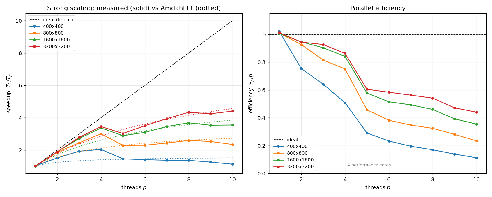
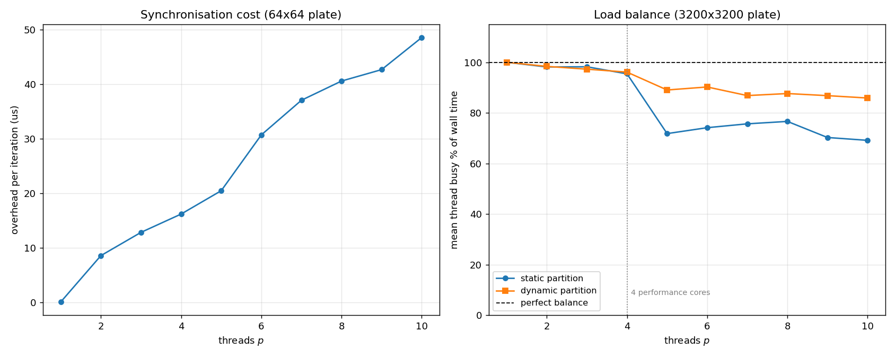
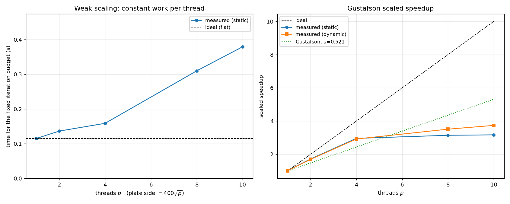
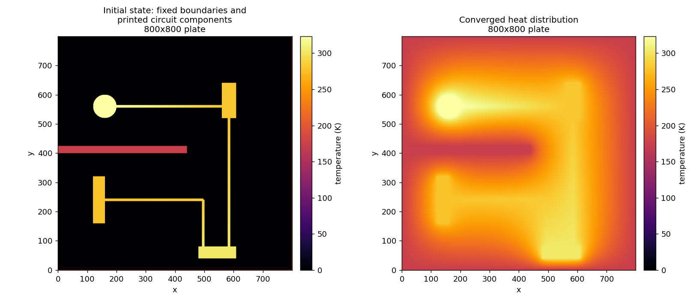

# 159.735 Assignment 3
## Parallel Solution of the Heat Distribution Problem

---

## 1. Platform

| | |
|---|---|
| Machine | Apple MacBook, Apple **M5** system on chip |
| Cores | **10 physical cores: 4 performance ("P") + 6 efficiency ("E")**, no SMT |
| Memory | 32 GB unified |
| Caches | 128 byte line; 16 MB L2 shared by the performance cluster |
| OS | macOS 26.3, arm64 |
| Compiler | Apple clang 21.0.0, `-O3` |
| OpenMP | LLVM `libomp` (Homebrew), `-Xpreprocessor -fopenmp -lomp` |
| FITS | cfitsio 4.7.0 (Homebrew) |

The heterogeneous core layout matters throughout this report. The machine
reports ten cores, but they are not ten of the same thing: the four
performance cores are several times faster than the six efficiency cores.
Almost every departure from ideal scaling measured below traces back to that
fact.

---

## 2. The problem and the numerical method

Laplace's equation is solved on a square plate by explicit finite
differences. The updated temperature of a pixel is the average of its four
neighbours,

```
g(y,x) = ( h(y,x-1) + h(y,x+1) + h(y-1,x) + h(y+1,x) ) / 4
```

which is Jacobi iteration: the whole new image `g` is computed from the old
image `h`, and only then does `g` become the current image.

The plate edge, the cold finger heat sink and the printed circuit components
are Dirichlet boundary conditions — they hold a fixed temperature for the
whole run. They are drawn by `fix_boundaries2()` from the supplied
`draw.hxx`, unmodified.

**Convergence.** A pixel has settled when it moved by less than
`tol = 1e-5 K` in a sweep. The plate has converged when *every* interior
pixel has settled. Pixels on the outer edge are fixed, so they are converged
by definition and are left out of the count; requiring all
`(npix-2) x (npix-2)` interior pixels to settle is exactly equivalent to
requiring all `npix x npix` of them.

The number of iterations this takes is not known in advance. Jacobi's
convergence rate is set by the spectral radius of its iteration matrix,
`cos(pi/(n+1)) ~ 1 - pi^2/2n^2`, which predicts an iteration count growing as
`n^2`. The measured counts fit `n^1.83` -- slightly below `n^2` because the
stopping test is an absolute threshold on the per-iteration *change*, and the
change at a given error level is itself proportional to `1/n^2`, so the test
is relatively easier to satisfy on a larger plate. Folding that in, the model
`k = A n^2 (B - 2 ln n)` reproduces all four measured counts to within 2.5%:

| plate | 100x100 | 200x200 | 400x400 | 800x800 |
|---|---:|---:|---:|---:|
| iterations to converge | 3,711 | 13,543 | 47,875 | 165,265 |

---

## 3. The programs

| File | What it is |
|---|---|
| `heat.cpp` | sequential solution |
| `heat_omp.cpp` | OpenMP parallel solution |
| `heatutil.hxx` | **everything the two have in common** — the Jacobi sweep itself, the fixed-pixel mask, the row partitioning, the timer, the image hash |
| `makefile` | `make heat`, `make heat_omp`, or just `make` |
| `run_scaling.sh`, `analyse.py` | the measurements and figures in this report |
| `make_plate_figure.py` | renders the FITS output as a picture |

`array.hxx`, `arrayff.hxx`, `fits.hxx`, `fitsfile.h`, `fitsfile.cpp` and
`draw.hxx` are used exactly as supplied.

Putting the kernel in a shared header is not tidiness for its own sake. The
sequential and parallel programs call **the same `jacobi_sweep()` function**,
so a given pixel goes through the identical arithmetic in the identical order
whichever program computes it. That is the mechanism behind the
bit-identical results in section 5 — it is a structural property, not
something that happens to hold.

```bash
make
./heat 800                     # sequential, writes plate0.fit and plate1.fit
./heat_omp 800 -p 8            # 8 threads,  writes plate0.fit and plate1_omp.fit
./heat_omp 800 -p 8 -d         # dynamic partition instead of static blocks
```

Options: `-p N` threads, `-t TOL` tolerance, `-o FILE` output (`none` to skip
file writing when timing), `-i N` stop after N iterations (a benchmarking aid
only), `-d` dynamic partition.

### One optimisation worth describing

The obvious way to hold the circuit at a fixed temperature is to call
`fix_boundaries2()` on the new image every iteration, re-drawing the whole
circuit 165,000 times. Instead the program works out **once**, before the
loop, which pixels the drawing routines touch. It does this by running the
supplied drawing code on a scratch array pre-filled with a sentinel value;
any pixel that is no longer the sentinel afterwards is a fixed pixel. The
sweep then simply carries those pixels through unchanged.

This is numerically identical — the same pixels end up with the same values —
but it removes a serial O(n^2) section from the middle of the iteration loop,
which would otherwise have put a hard floor under the parallel runtime.

Both programs also **swap the two image buffers** rather than copying `g`
over `h`, which removes `n^2` float copies per iteration.

---

## 4. The parallel implementation

### 4.1 Partitioning

The plate is divided into horizontal strips of whole rows. Rows are the unit
of work because a row is contiguous in memory, so a thread that owns rows
`[y0, y1)` reads only **two** rows it does not own: the halo row immediately
above its strip and the halo row immediately below it.

Two ways of handing out the rows are implemented:

**Static blocks (default).** Each thread gets one contiguous block, assigned
once before the loop starts. The remainder is spread one row at a time over
the first few threads, so no two threads ever differ by more than a single
row. There is no bookkeeping during the run, and cache locality is as good as
it can be because a thread revisits its own rows every iteration.

**Dynamic self-scheduling (`-d`).** The rows are cut into chunks of about
`nrows / (4 * nthreads)` and threads take the next chunk from a shared counter
via `#pragma omp atomic capture`. This costs one atomic increment per chunk
and gives up some locality, but a slow thread simply takes fewer chunks. On a
machine with four fast cores and six slow ones, that turns out to matter a
great deal (section 7.3).

Both were implemented because the textbook answer — a static block partition
— is provably the right choice on a homogeneous machine and demonstrably not
the right choice on this one.

### 4.2 The thread pool

The pool is created **once**, outside the iteration loop:

```cpp
#pragma omp parallel default(shared)
{
    ...
    for (;;) {           // the whole do-while loop lives inside the region
        ...
    }
}
```

The alternative — a `#pragma omp parallel for` inside the loop — would fork
and join a team 165,000 times for an 800x800 plate.

### 4.3 Synchronisation

This is the local synchronisation problem from the lectures: a thread must
not run ahead of the neighbours it shares halo rows with. Two team-wide
barriers per iteration are enough, and are far simpler than pairwise
neighbour signalling:

```cpp
counts[tid].n = jacobi_sweep(h.buffer, g.buffer, fixedp, npixx, y0, y1, tol);

#pragma omp barrier                       // (1)

#pragma omp single
{
    int total = 0;
    for (int t = 0; t < nth; ++t) total += counts[t].n;
    ++iter;
    done = (total >= nrequired) || (iter >= itmax);
    std::swap(h.buffer, g.buffer);
}                                         // (2) implicit barrier

if (done) break;
```

**Barrier (1)** is the important one. Without it a fast thread could finish
its strip, start the next iteration, and begin overwriting a row of `h` that
a neighbour is still reading as a halo row. It also guarantees every
per-thread convergence count is visible before anyone reads them.

**Barrier (2)**, implicit at the end of `single`, protects the buffer swap:
while one thread swaps the pointers, every other thread is parked at that
barrier and cannot be reading either image. After it, all threads see the
swapped buffers and the same termination verdict.

A team-wide barrier is stronger than this problem strictly needs — a thread
only genuinely depends on its two neighbours — but `libomp`'s barrier is a
tuned, actively-spinning tree barrier, and hand-rolled neighbour flags would
have to reimplement that badly. Section 7.2 measures what it costs.

### 4.4 Detecting convergence and terminating cleanly

The iteration count cannot be fixed in advance, so convergence has to be
tested every iteration, and every thread has to agree on the answer.

Each thread counts settled pixels **in its own rows only**, and writes that
count into its own slot of a shared array. Each slot occupies a full 128 byte
cache line:

```cpp
struct PaddedCount { int n; char pad[CACHE_LINE - sizeof(int)]; };
```

Packed together, ten counters would share one or two cache lines and the
threads would spend their time bouncing those lines between cores — false
sharing, and on a per-iteration counter it is expensive.

After barrier (1), one thread sums the slots and compares against
`(npix-2)^2`. The verdict goes into **one shared `bool done`**, and every
thread reads that same flag after barrier (2).

That single shared flag is what makes termination clean. Every thread
evaluates `if (done) break;` on the same iteration, having read the same
value after the same barrier. So either the whole team continues or the whole
team leaves. No thread can exit early and leave a neighbour's halo row
unwritten, and — the failure mode that actually bites in practice — no thread
can be left waiting forever at a barrier that the rest of the team has
already walked away from.

### 4.5 Why the answer does not depend on the thread count

Three properties combine:

1. **Jacobi is partition-independent.** A new pixel value is a function of
   the *previous* image only. Splitting the rows between threads changes who
   computes a pixel, never what it computes.
2. **Both programs run the same code.** `jacobi_sweep()` is shared, so the
   four additions and the multiply happen in the same order, with the same
   float rounding, in both programs.
3. **The convergence test is exact.** It is a count of integers reduced by
   addition — no floating point rounding is involved in the stop decision, so
   the stop happens on exactly the same iteration every time.

Consequently the parallel program does not merely produce a *similar* image
in a *similar* number of iterations; it produces the identical image in the
identical number of iterations, which is what section 5 verifies.

---

## 5. Verification

Each program prints an FNV-1a hash of the raw bytes of the final image. This
is compared rather than the FITS files themselves, whose headers carry
timestamps.

Every plate size was run to full convergence with the sequential program and
with the OpenMP program at a range of thread counts, in both partition modes:

| npix | iterations | distinct iteration counts | distinct image hashes | runs compared |
|---:|---:|---:|---:|---:|
| 100 | 3,711 | 1 | 1 | 30 |
| 200 | 13,543 | 1 | 1 | 30 |
| 400 | 47,875 | 1 | 1 | 30 |
| 800 | 165,265 | 1 | 1 | 13 |

**One iteration count and one image hash per plate size, across every
configuration tested.** The requirement that the parallel program run in the
same number of iterations as the sequential version and produce the same
output is met exactly, not approximately.

---

## 6. How the timings were taken

Two measurement problems had to be dealt with first, and both are worth
recording because both produced confidently wrong numbers before they were
noticed.

**`omp_get_wtime()` counts time the machine spends asleep.** LLVM's runtime
implements it with `gettimeofday()`, which is wall clock time. This laptop is
configured to sleep after one minute idle on battery, so an unattended
benchmark reported runs of up to 4,893 seconds inside a suite that used about
fifteen minutes of CPU — the sleep was being billed to whichever run happened
to straddle it. Worse, the sequential program was using `steady_clock` while
the parallel program used `omp_get_wtime()`, so the two were not even being
timed by the same clock. Both programs now share one `wall_seconds()` helper
built on the monotonic `steady_clock`, which does not advance across a system
sleep, and the benchmark script re-executes itself under `caffeinate` so the
machine cannot doze off mid-run.

**The machine has other work to do.** This is a laptop running a browser, an
IDE and an office suite; the load average sat between 3 and 6.6 during the
measurements. Each configuration is therefore measured five times with the
repeats interleaved, and the **fastest** run is used, that being the reading
least polluted by other processes. The load average is recorded alongside
every measurement. Across all configurations the median run was 1% slower
than the fastest and the worst was 11% slower, so the numbers below are
repeatable to a few percent — good enough for the conclusions drawn, though
not laboratory-grade.

Timing runs use a fixed iteration budget (`-i`) chosen so that a sequential
run takes about a second. This only bounds how long a measurement takes; the
work per iteration is identical for every thread count, so the speedups are
unaffected. The runs in section 5 and the picture in section 8 are complete
runs to convergence.

---

## 7. Results

### 7.1 Strong scaling — Amdahl's law

Fixed plate, varying thread count. Speedup is measured against the
**sequential program**, not against the parallel program on one thread.



| plate | best speedup | at threads | fitted Amdahl `f` | ceiling `1/f` |
|---|---:|---:|---:|---:|
| 400x400 | 1.97x | 4 | 0.646 | 1.5x |
| 800x800 | 2.96x | 4 | 0.296 | 3.4x |
| 1600x1600 | 3.71x (4.23x dynamic) | 8–9 | 0.177 | 5.7x |
| 3200x3200 | 4.35x (4.85x dynamic) | 8–10 | 0.134 | 7.5x |

Selected detail for the 3200x3200 plate:

| threads | time (s) | speedup | efficiency | thread busy % |
|---:|---:|---:|---:|---:|
| 1 | 0.843 | 1.00 | 1.00 | 100% |
| 2 | 0.439 | 1.92 | 0.96 | 98% |
| 3 | 0.311 | 2.71 | 0.90 | 98% |
| **4** | **0.241** | **3.50** | **0.88** | **96%** |
| 5 | 0.280 | 3.01 | 0.60 | 73% |
| 8 | 0.194 | 4.35 | 0.54 | 77% |
| 10 | 0.194 | 4.35 | 0.43 | 69% |

**Does it obey Amdahl's law?** Yes, in the sense that matters: the speedup
saturates rather than growing with `p`, and the measured curve is described
well by `S(p) = 1 / (f + (1-f)/p)`. The fitted serial fraction falls
steadily as the plate grows — 0.646, 0.296, 0.177, 0.134 — which is the
central Amdahl prediction: **the same program has a different ceiling
depending on how much work each processor is given.** At 400x400 the ceiling
is about 1.5x no matter how many cores are thrown at it, and the measurements
duly stop at 1.97x; at 3200x3200 the ceiling is about 7.5x.

Two honest qualifications:

- The `f` fitted here is not literally serial *code*. The only genuinely
  serial region in the program is the `single` block, which adds at most ten
  integers. What `f` actually captures is **per-iteration overhead and load
  imbalance**, which happen to have the same functional effect on the speedup
  curve. Amdahl's law is being used here as a phenomenological description,
  which is how it is normally used in practice, but it is worth being precise
  about.
- The curve is not smooth. There is a pronounced **break between 4 and 5
  threads** in every single measurement, and efficiency drops off a cliff
  there — from 88% to 60% at 3200x3200. That is not noise and it is not
  Amdahl; it is the fifth thread landing on an efficiency core. Section 7.3.

At the small end, the parallel program is simply **slower** than the
sequential one:

| npix | iterations | sequential (s) | best parallel (s) | threads | speedup |
|---:|---:|---:|---:|---:|---:|
| 100 | 3,711 | 0.016 | 0.016 | 1 | 1.00 |
| 200 | 13,543 | 0.243 | 0.242 | 1 | 1.01 |
| 400 | 47,875 | 3.580 | 1.884 | 4 | 1.90 |
| 800 | 165,265 | 51.883 | 17.711 | 4 | 2.93 |

For a 100x100 plate, running on ten threads takes **almost thirteen times
longer** (0.200 s against 0.016 s) than running sequentially. Section 7.2 explains why, and it is the purest possible
illustration of Amdahl's point: below a certain problem size, parallelism
costs more than it buys.

### 7.2 Where the overhead comes from

A 64x64 plate is small enough that the arithmetic is nearly free, so whatever
the parallel run costs above the sequential one is the price of the two
barriers and the reduction:

| threads | 2 | 4 | 6 | 8 | 10 |
|---|---:|---:|---:|---:|---:|
| overhead (us/iteration) | 8.1 | 14.7 | 32.7 | 41.7 | 59.0 |

Roughly 6 microseconds per additional thread. Compare that with the
sequential cost of one iteration:

| plate | 400x400 | 800x800 | 1600x1600 | 3200x3200 |
|---|---:|---:|---:|---:|
| sequential time per iteration | 76 us | 312 us | 1,340 us | 5,440 us |
| 10-thread overhead as a fraction of it | **78%** | 19% | 4.4% | 1.1% |

This is the whole story of the size dependence in one line. At 400x400 the
synchronisation needed to run an iteration on ten threads costs nearly as
much as computing the iteration outright, so ten threads cannot win. At
3200x3200 it is one percent and effectively free.

Note also that the overhead grows with thread count while the work per thread
shrinks — the two move in opposite directions, which is why every curve in
the speedup plot eventually turns over.

### 7.3 Load balance and the two kinds of core

Each thread accumulates how long it spent inside `jacobi_sweep()`. Comparing
that against the wall clock says how much of the run a thread spent working
rather than waiting at a barrier.



3200x3200 plate, mean thread busy percentage:

| threads | 2 | 3 | **4** | **5** | 6 | 8 | 10 |
|---|---:|---:|---:|---:|---:|---:|---:|
| static partition | 98% | 98% | **96%** | **73%** | 75% | 77% | 69% |
| dynamic partition | 99% | 97% | **97%** | **89%** | 91% | 88% | 86% |

The static partition holds 96–99% efficiency for up to four threads and then
falls off a cliff at the fifth. The reason is that the static partition gives
every thread an equal number of rows, which is the correct thing to do only
if every core is equally fast. The fifth thread runs on an efficiency core,
takes far longer over its equal share, and **every barrier runs at the speed
of the slowest thread**. At ten threads the busiest thread is working 85% of
the time while the idlest works 48% — half the pool is sitting at a barrier.

The dynamic partition fixes most of this without any knowledge of which core
is which: a thread on a slow core simply claims fewer chunks. It lifts
balance at ten threads from 69% to 86% and the best speedup from 4.35x to
4.85x. It costs a little at four threads, where the static partition's
perfect locality wins and there is no imbalance to correct.

The size of the effect can be estimated from the data. Four performance cores
deliver 3.50x. Adding six efficiency cores takes that to 4.85x, so the six of
them together contribute about 1.35x — roughly **a quarter of a performance
core each** for this memory-bound kernel. Ten cores, but only about five and
a half cores' worth of throughput, which caps any speedup on this machine at
around 5x however good the software is.

Memory bandwidth is the other ceiling at the largest sizes. At 3200x3200 the
two images and the mask occupy 92 MB, far beyond any cache, so the kernel
streams from DRAM. Taking about 9 bytes of traffic per pixel update (one new
float read, one float written, one mask byte — the three active rows stay
resident), the sequential run moves about 17 GB/s and the best 10-thread run
about 82 GB/s, against roughly 150 GB/s of peak bandwidth on this chip. At
better than half of peak the memory system is a real co-limiter, and no
amount of load balancing would remove it.

### 7.4 Weak scaling — Gustafson's law

The plate side grows as `400*sqrt(p)`, so the number of pixels per thread —
and therefore the arithmetic each thread does per iteration — stays constant
at about 160,000. Perfect scaling keeps the parallel time flat and gives a
scaled speedup of `p`.



| p | npix | pixels/thread | sequential (s) | parallel (s) | scaled speedup | dynamic | scaled speedup |
|---:|---:|---:|---:|---:|---:|---:|---:|
| 1 | 400 | 160,000 | 0.121 | 0.118 | 1.03 | 0.116 | 1.05 |
| 2 | 566 | 160,178 | 0.230 | 0.135 | 1.70 | 0.138 | 1.67 |
| 3 | 693 | 160,083 | 0.348 | 0.147 | 2.36 | 0.149 | 2.35 |
| 4 | 800 | 160,000 | 0.476 | 0.159 | **3.00** | 0.157 | **3.04** |
| 6 | 980 | 160,066 | 0.710 | 0.266 | 2.66 | 0.217 | 3.27 |
| 8 | 1131 | 159,895 | 0.941 | 0.288 | 3.27 | 0.269 | 3.50 |
| 10 | 1265 | 160,022 | 1.174 | 0.371 | 3.16 | 0.329 | **3.57** |

Fitting `S = p - a(p-1)` gives `a = 0.51` static, `a = 0.48` dynamic.

**Does it scale up for larger problems in accordance with Gustafson's Law?**
Partly, and the way it fails is informative.

Gustafson's point is that the *sequential* time grows with the scaled problem
while the parallel time need not — and that is exactly what the third and
fourth columns show. Sequential time rises almost perfectly linearly, 0.121 s
to 1.174 s, a factor of 9.7 for a factor of 10 in work. Meanwhile parallel
time rises only from 0.118 s to 0.329 s. Ten times the problem is solved in
under three times the time. That is the Gustafson argument working:
**enlarging the problem in step with the machine is far more effective than
trying to make a fixed problem faster.** Compare the 3.57x scaled speedup at
ten threads against the 1.08x that ten threads managed on a fixed 400x400
plate in section 7.1 — the same program, the same threads, an entirely
different outcome.

But it does not reach the ideal `S = p` line, and it stops improving after
four threads. Up to four threads the scaled speedup tracks the ideal closely
(1.70, 2.36, 3.00 against 2, 3, 4); beyond that it flattens. The cause is the
same as before: threads five to ten are on efficiency cores, so "constant
work per thread" is not constant work per unit time. Gustafson's law assumes
`p` equal processors, and this machine does not have ten of those. On the
four performance cores alone the law is obeyed almost exactly; the fitted
`a = 0.5` is measuring hardware heterogeneity, not a serial section in the
program.

---

## 8. The heat distribution

800x800 plate, run to convergence — 165,265 iterations, tolerance 1e-5 K.
Final temperatures range from 173 K (the cold plate edge and the cold finger)
to 323 K (the hot circular component), mean 233.21 K.



The left panel is the initial state: the fixed boundary, the cold finger heat
sink as the dark horizontal bar, and the printed circuit components, with the
rest of the plate at 0 K. The right panel is the converged solution. Heat has
spread from the components into the plate, the cold finger has cut a distinct
cool channel across the middle, and the cold edge draws heat out all round.
The isotherms bulge away from the hot circular pad at upper left and are
compressed between the components and the cold finger, which is where the
steepest gradients — and in a real board, the thermal stress — would be.

---

## 9. Conclusions

1. The OpenMP program produces a **bit-identical image in an identical number
   of iterations** to the sequential program, at every thread count and both
   partition strategies. This follows structurally from Jacobi being
   partition-independent, the two programs sharing one kernel, and the
   convergence test being an exact integer count.

2. **Amdahl's law is obeyed**, with the fitted serial fraction falling from
   0.646 at 400x400 to 0.134 at 3200x3200. The per-iteration synchronisation
   cost — measured directly at 8 us for two threads rising to 59 us for ten —
   is what sets that fraction, and it explains both the ceiling at each size
   and why a 100x100 plate runs nearly thirteen times slower on ten threads
   than on one.

3. **Gustafson's law is obeyed on the performance cores and limited by
   hardware beyond them.** Ten times the problem is solved in 2.8 times the
   time, and scaled speedup tracks the ideal line closely up to four threads
   before flattening at about 3.6.

4. **The binding constraint on this machine is that it does not have ten
   equal cores.** Four performance cores give 3.50x at 88% efficiency; the
   six efficiency cores add only about 1.35x between them. A static equal-row
   partition, which is the textbook-correct choice, is actively the wrong one
   here because every barrier waits for the slowest thread — measured busy
   time falls to 69%. Switching to dynamic self-scheduling recovers balance
   to 86% and lifts the best speedup from 4.35x to 4.85x, without changing a
   single output value.

5. If more speedup were needed, the next steps would be algorithmic rather
   than mechanical: red-black Gauss-Seidel or successive over-relaxation
   would cut the *number* of iterations by a large factor, which is worth far
   more than the remaining few tens of percent available from tuning the
   parallel decomposition. Multigrid would be better still. Jacobi's `n^2`
   iteration count, not its per-iteration parallelism, is the real cost of
   this method.
